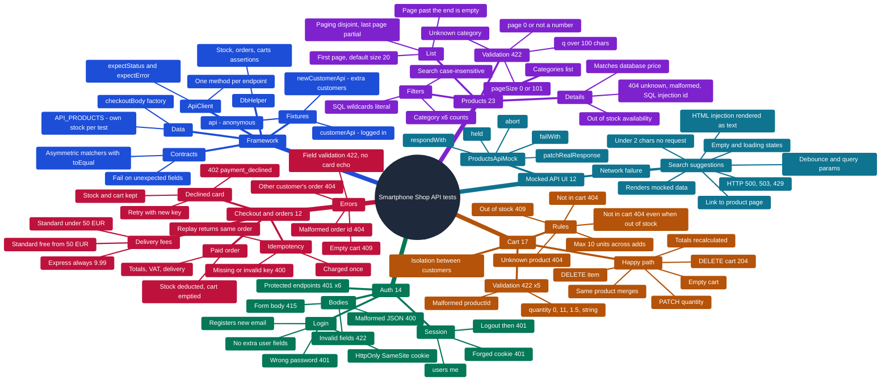

# API tests mindmap

REST API tests (`api` project, `tests/e2e/tests/api`) and the related mocked-API UI tests. 66 API tests plus 12 mock tests.

```mermaid
%%{init: {
  "theme": "base",
  "themeVariables": {
    "primaryColor": "#1e293b", "primaryTextColor": "#ffffff",
    "git0": "#1e293b", "gitBranchLabel0": "#ffffff",
    "cScale0": "#334155", "cScaleLabel0": "#ffffff",
    "cScale1": "#1d4ed8", "cScaleLabel1": "#ffffff",
    "cScale2": "#7e22ce", "cScaleLabel2": "#ffffff",
    "cScale3": "#047857", "cScaleLabel3": "#ffffff",
    "cScale4": "#b45309", "cScaleLabel4": "#ffffff",
    "cScale5": "#be123c", "cScaleLabel5": "#ffffff",
    "cScale6": "#0e7490", "cScaleLabel6": "#ffffff",
    "cScale7": "#4338ca", "cScaleLabel7": "#ffffff"
  }
}}%%
mindmap
  root((Smartphone Shop API tests))
    Framework
      ApiClient
        One method per endpoint
        expectStatus and expectError
      Contracts
        Asymmetric matchers with toEqual
        Fail on unexpected fields
      Fixtures
        api - anonymous
        customerApi - logged in
        newCustomerApi - extra customers
      Data
        API_PRODUCTS - own stock per test
        checkoutBody factory
      DbHelper
        Stock, orders, carts assertions
    Products 23
      List
        First page, default size 20
        Paging disjoint, last page partial
        Page past the end is empty
      Filters
        Category x6 counts
        Search case-insensitive
        SQL wildcards literal
      Validation 422
        Unknown category
        page 0 or not a number
        pageSize 0 or 101
        q over 100 chars
      Details
        Matches database price
        Out of stock availability
        404 unknown, malformed, SQL injection id
      Categories list
    Auth 14
      Login
        Registers new email
        HttpOnly SameSite cookie
        No extra user fields
        Wrong password 401
      Bodies
        Invalid fields 422
        Form body 415
        Malformed JSON 400
      Session
        users me
        Logout then 401
        Forged cookie 401
      Protected endpoints 401 x6
    Cart 17
      Happy path
        Empty cart
        Totals recalculated
        Same product merges
        PATCH quantity
        DELETE item
        DELETE cart 204
      Rules
        Max 10 units across adds
        Out of stock 409
        Unknown product 404
        Not in cart 404
        Not in cart 404 even when out of stock
      Validation 422 x5
        quantity 0, 11, 1.5, string
        Malformed productId
      Isolation between customers
    Checkout and orders 12
      Paid order
        Totals, VAT, delivery
        Stock deducted, cart emptied
      Idempotency
        Replay returns same order
        Charged once
        Missing or invalid key 400
      Declined card
        402 payment_declined
        Stock and cart kept
        Retry with new key
      Delivery fees
        Standard under 50 EUR
        Standard free from 50 EUR
        Express always 9.99
      Errors
        Empty cart 409
        Field validation 422, no card echo
        Other customer's order 404
        Malformed order id 404
    Mocked API UI 12
      ProductsApiMock
        respondWith
        failWith
        abort
        held
        patchRealResponse
      Search suggestions
        Renders mocked data
        Debounce and query params
        Under 2 chars no request
        Empty and loading states
        HTTP 500, 503, 429
        Network failure
        Link to product page
        HTML injection rendered as text
```
